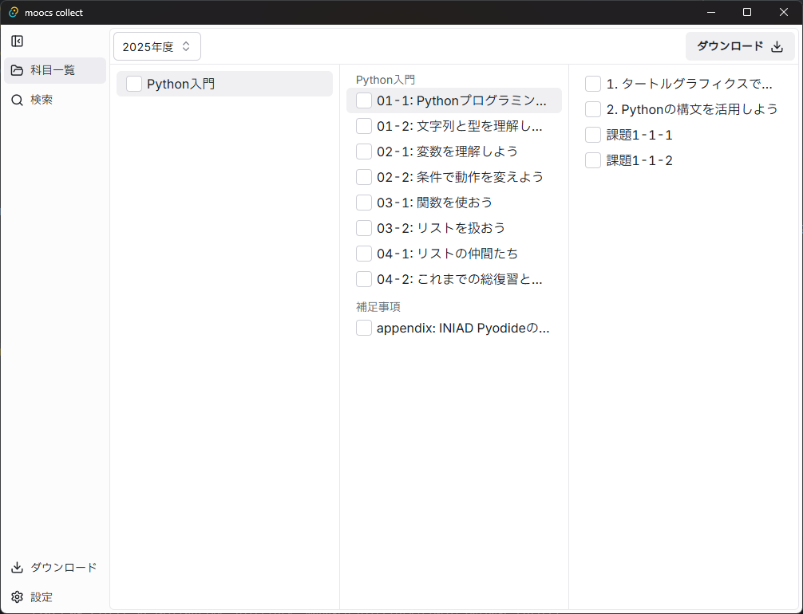
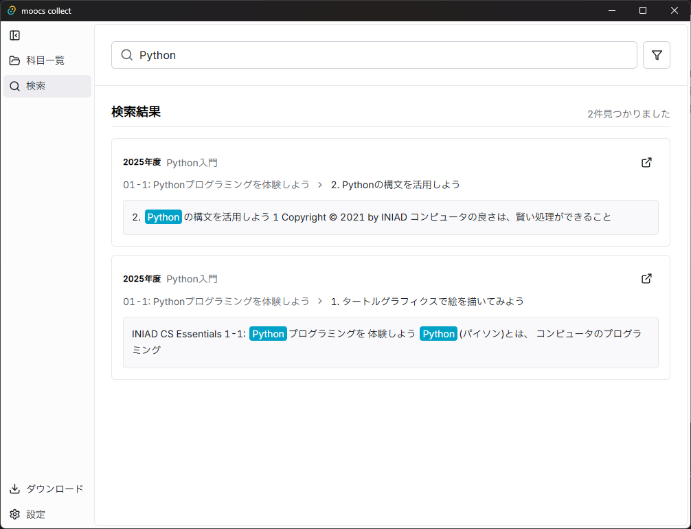

# Moocs Collect

INIAD Moocs から授業スライドを効率的にダウンロードするためのアプリケーション

🏡 [ホームページ・ダウンロード](https://yu7400ki.github.io/moocs-collect)

[](https://github.com/yu7400ki/moocs-collect/releases)
[](LICENSE)

## 機能

- 一括ダウンロード: 効率的なスライド取得
- クロスプラットフォーム: Windows、macOS、Linux対応
- PDF出力: スライドをPDFとして保存
- 全文検索: ダウンロードしたスライドの高速検索（デスクトップアプリ）

## クイックスタート

### デスクトップアプリ

#### インストール

[ホームページ](https://yu7400ki.github.io/moocs-collect) から最新版をダウンロードしてください。

- Windows: `.msi` または `.exe` ファイル
- macOS: `.dmg` または `.tar.gz` ファイル
- Linux: `.AppImage` または `.deb`、`.rpm` ファイル

[GitHubリリースページ](https://github.com/yu7400ki/moocs-collect/releases)からも直接ダウンロード可能です。




### CLI版

#### インストール

[リリースページ](https://github.com/yu7400ki/moocs-collect/releases)からプラットフォームに合わせたバイナリをダウンロードしてください。

#### 基本的な使い方

```bash
collect-cli --path ~/Downloads --year 2024
```

| オプション | 説明                     | 例                    |
|------------|--------------------------|----------------------|
| `--path`   | ダウンロード先ディレクトリ | `~/Downloads`        |
| `--year`   | 対象年度                 | `2025`               |

実行後は対話形式で授業・講義・ページを選択できます。

## アーキテクチャ

```
moocs-collect/
├── src/                 # コアライブラリ (Rust)
├── apps/
│   ├── cli/            # CLI アプリケーション
│   ├── desktop/        # Tauri デスクトップアプリ
│   └── website/        # Webサイト
└── ...
```

## 開発

### 必要環境

- Rust:
- Node.js
- pnpm

### セットアップ

```bash
# リポジトリクローン
git clone https://github.com/yu7400ki/moocs-collect.git
cd moocs-collect

# 依存関係インストール
pnpm install

# Rust依存関係
cargo build --workspace
```

### 開発コマンド

```bash
# CLI
cargo run -p collect-cli -- --path ./test --year 2024

# デスクトップアプリ
pnpm --filter=desktop tauri dev

# Webサイト
pnpm --filter=website dev

# lint
pnpm lint
cargo clippy --workspace
cargo fmt --all -- --check
```

### ビルド

```bash
# CLI
cargo build --release -p collect-cli

# デスクトップアプリ
pnpm --filter=desktop tauri build

# Webサイト
pnpm --filter=website build
```

## ライセンス

[MIT License](LICENSE)

---

<p align="center">
  Made with ❤️ for INIAD students
</p>
